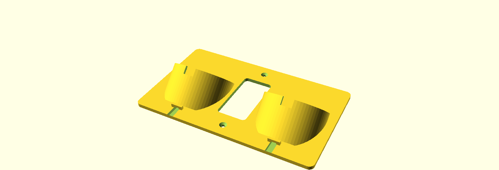

# Fi collar charger plate

A 3D-printed **Decora outlet faceplate** that holds **two Fi Series 3 dog-collar
charging bases** in flanking cradles, charges the collars in place, keeps the
outlet usable, and routes the micro-USB cables down to a single exit.



## What it mates with

- **Outlet:** standard single-gang **Decora / rocker** receptacle. Mounts with
  the existing two **6-32** strap screws, **3.812" (96.85 mm)** center-to-center.
  The Decora opening is left clear so the receptacle stays usable.
- **Chargers:** two round **Fi Series 3 charging bases** (the black pucks). The
  collar's module drops into the recess on the base's top face and charges by
  contact (LED pulses blue). The holder grips the *base*; the base does the
  charging and collar retention. Powered by a micro-USB cable out of each base.

## How it works

Each base sits in a cup cradle that **leans back** (`cradle_tilt`, default 45°)
so the charging face aims **up-and-out** — the collar module seats by gravity
and stays put while charging. The collar band drapes down the front of the
plate. The base's micro-USB cable exits a **notch** in the cup's lower lip and
drops into a **front-face channel** with a snap-over clip, routing to the bottom
edge and on to the power strip below.

The wall side is clipped dead flat (the tilted cups blend into the plate via a
skirt that is sheared off at the wall plane), so it mounts flush.

## ⚠️ Measure before you print

Every fit-critical number is a parameter at the top of
[src/fi-collar-charger-plate.scad](src/fi-collar-charger-plate.scad). The defaults
are **placeholders** — measure your actual Fi base and drop the real numbers in:

| Parameter    | Meaning                                   | Default (placeholder) |
|--------------|-------------------------------------------|-----------------------|
| `base_dia`   | outer diameter of the round Fi base       | **64 mm — MEASURE**   |
| `base_thick` | puck thickness / height                   | **14 mm — MEASURE**   |
| `cable_exit` | `"side"` or `"bottom"` micro-USB exit     | `"side"` — confirm    |
| `base_clear` | radial fit clearance (snug)               | 0.6 mm                |
| `cradle_tilt`| base face angle from vertical             | 45°                   |

Re-export after editing: `just build` (or override headless, e.g.
`openscad -D 'base_dia=58' -D 'base_thick=12' -o out.stl src/...scad`).

## Size note (the honest trade-off)

A face-up puck held near a wall **inherently sticks out** — there is no way to
charge a collar face-up against a wall without a shelf-like protrusion. At the
64 mm placeholder size the plate comes out **~202 × 123 × 4 mm (8.0 × 4.8")** and
the cups stand **~35–45 mm proud** of the wall. Levers to shrink it:

- **Smaller real `base_dia`** — likely; 64 mm is a guess from the photo.
- **Lower `cradle_tilt`** — flatter to the wall, less protrusion, but the collar
  leans more on the base's own recess to stay seated.
- **Switch layout to stacked** (cups above the opening, not flanking) — a much
  narrower plate (~75 mm wide). This is a code change, not a parameter.

## Print settings (suggested — update after first print)

- Material: PETG or PLA+ (near an outlet; PETG tolerates warmth better).
- Layer height: 0.2 mm. Walls: 3+ perimeters. Infill: 20–30%.
- **Orientation:** plate back (wall side) flat on the bed; cups face up. The
  skirt ramp behind each cup prints as a self-supporting overhang at 45°; at
  higher `cradle_tilt` the cup's upper lip may want a little support.
- Screws: reuse the outlet's existing 6-32 screws; `screw_clear`/`screw_head`
  are sized for a flat-head countersink on the front face.

## Build

```
just build      # export export/fi-collar-charger-plate.stl (high $fn)
just preview    # re-render images/*.png (needs xvfb on this headless host)
just dims       # print derived plate size / cup bore without exporting
just clean      # remove generated STL
```

BOSL2 is pulled from `~/.local/share/OpenSCAD/libraries` via `OPENSCADPATH`
(wired into the justfile).

## Status

**v1 — first complete parametric design, rendered + manifold (`Simple: yes`).**
Not yet printed; dimensions are placeholders pending measurement. See the table
above.
